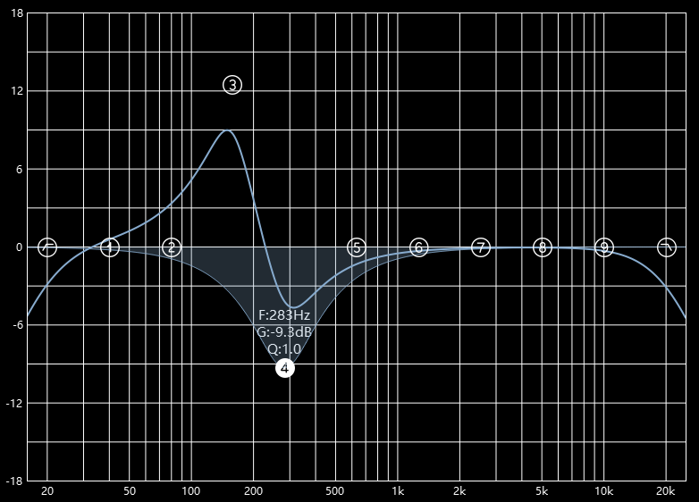
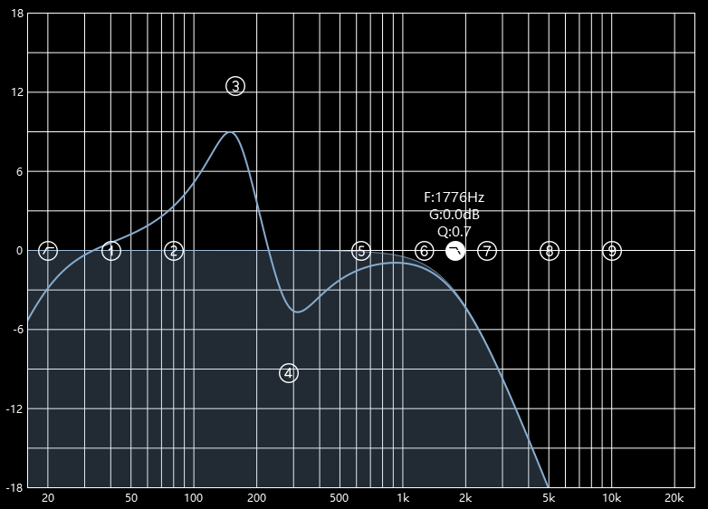
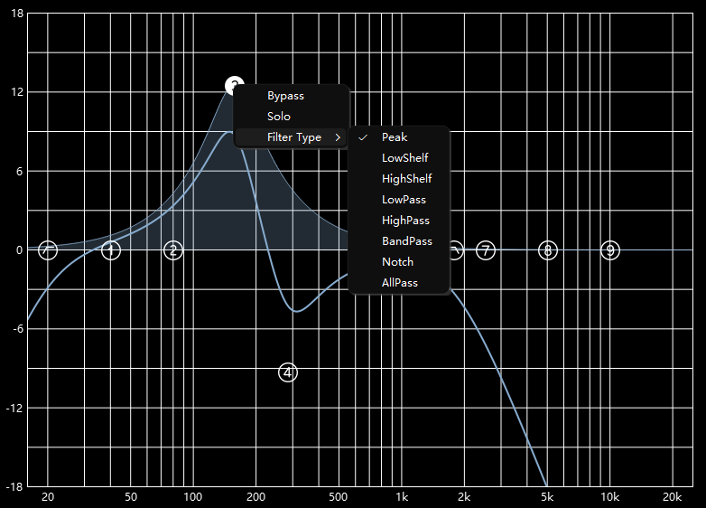

# EqCustomPlot

<p align="center">
  <a href="README.md">English</a> | <a href="README_CN.md">中文</a>
</p>

<p align="center">
  
  
  
</p>

一个基于 Qt 与 QCustomPlot 的交互式均衡器（EQ）频响可视化与编辑器。它演示了如何组合多段二阶滤波（biquad），实时绘制叠加后的幅频响应，并提供便捷的交互来编辑每段的参数。

本项目面向 Qt 6.5+，使用如下模块：Core、Widgets、Svg、PrintSupport；并包含自定义的对数频率轴刻度器。

## 功能亮点

- 交互式多段 EQ 编辑（共 11 段）：高通、9 个参数段（1–9）、低通。
- 实时显示各段曲线与总体叠加曲线。
- 对数频率坐标（约 16 Hz–25 kHz）与幅值范围 −18 dB … +18 dB。
- 每段右键菜单：
  - 滤波类型：Peak、LowShelf、HighShelf、LowPass、HighPass、BandPass、Notch、AllPass
  - 按段 Bypass
  - Solo 单段（临时旁路其他段）
- 主题化 SVG 图标（深色/浅色），通过 Qt 资源系统加载。
- 基于 QCustomPlot 的高质量抗锯齿绘图与网格美化。

## 截图 / 演示

## 构建要求

- Qt 6.5 或更新版本
  - 组件：Core、Widgets、Svg、PrintSupport
- CMake ≥ 3.19
- 支持 C++17 的编译器

项目通过根目录 `CMakeLists.txt` 配置，构建可执行程序 `EqCustomPlot`。

## 构建与运行（CMake）

```bash
# 在项目根目录
cmake -S . -B build -DCMAKE_PREFIX_PATH=<Qt/6.x.x/对应编译器路径> \
      -DCMAKE_BUILD_TYPE=Release
cmake --build build --config Release

# Windows 可执行文件通常位于：
#   build/Release/EqCustomPlot.exe
# Linux/macOS 通常位于：
#   build/EqCustomPlot

# 可选：安装/部署（使用 qt_generate_deploy_app_script）
cmake --install build --config Release
```

说明：

- 若 Qt 未在默认 CMake 前缀路径，请设置 `CMAKE_PREFIX_PATH` 指向你的 Qt 安装路径（例如 `C:/Qt/6.5.3/msvc2019_64`）。
- 已启用 `CMAKE_AUTORCC`，会自动编译 `resources.qrc`。

## 使用说明

- 启动应用，主界面中心控件即为 `EqCustomPlot`。
- 左键点击某一段（图标）以选中；拖动以调整频率和增益。
- 在该段上右键可打开菜单：
  - 切换 `Bypass`
  - 切换 `Solo`
  - 修改 `Filter Type`
- 上方粗线为总体频响曲线；每段都有各自的曲线以辅助调节。

## 代码结构

- `main.cpp`：Qt 程序入口。
- `mainwindow.*`：创建 `QMainWindow`，将 `EqCustomPlot` 作为中心控件。
- `eqcustomplot.*`：交互逻辑与绘图；上下文菜单、图标、段管理、重绘等。
- `qcpaxistickerfreq.*`：自定义非等距刻度器，用于对数频率轴的刻度与标签。
- `eq.*`：二阶滤波器计算相关：
  - `getSectionsMatrix(...)`：按段计算滤波器系数（SOS）。
  - `getFreqzn(...)`：计算单段或多段叠加的幅频响应（dB）。
- `qcustomplot.*`：QCustomPlot 源码（随项目托管）。
- `resources.qrc`：Qt 资源清单，包含 `image/` 下的深浅色 SVG 图标。
- `image/`：图标资源目录。
- `CMakeLists.txt`：构建配置。

## 技术细节

- 频率轴使用对数刻度；`QCPAxisTickerFreq` 负责十进制分段与标签的“1k/2k/5k”友好取整。
- 幅值轴通过 `QCPAxisTickerText` 显示均匀分布的 dB 标签。
- 默认参数与范围：
  - X 轴：16 … 25,000（对数）
  - Y 轴：−18 … +18 dB
  - 采样率：384,000 Hz
  - 频率点数：1,024
- 每段通过 `QCPGraph::setProperty` 持有默认与运行时属性（如 `defaultQ`、`defaultFreq`、`type`、`bypass`）。

## 参与贡献

欢迎贡献！如计划提交 PR：

- 保持与当前项目一致的代码风格。
- 注重可读性与注释。
- 至少在一个桌面平台（Windows/Linux/macOS）做基本验证。
